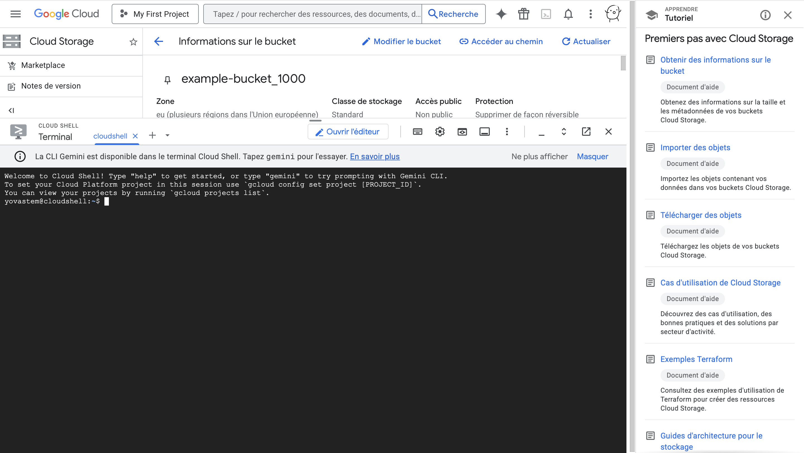
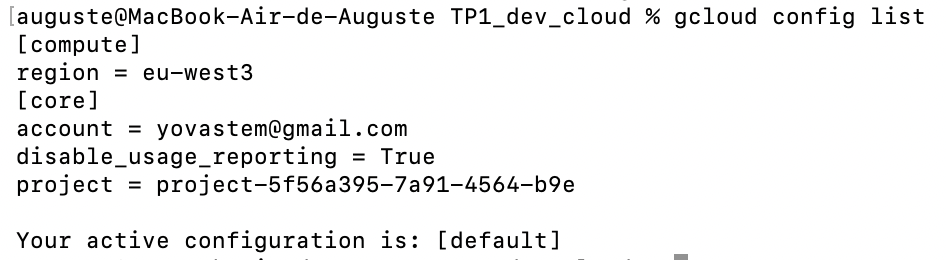
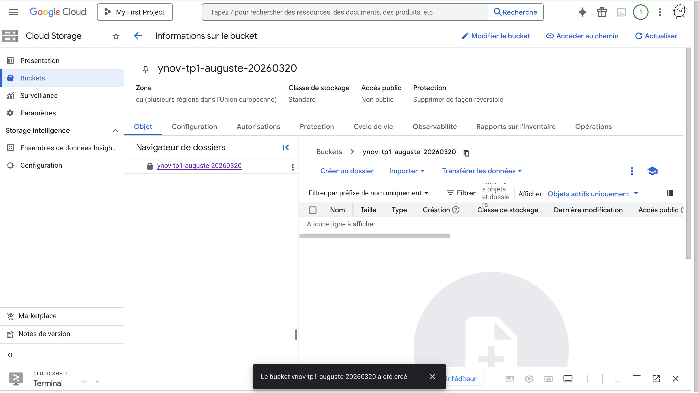
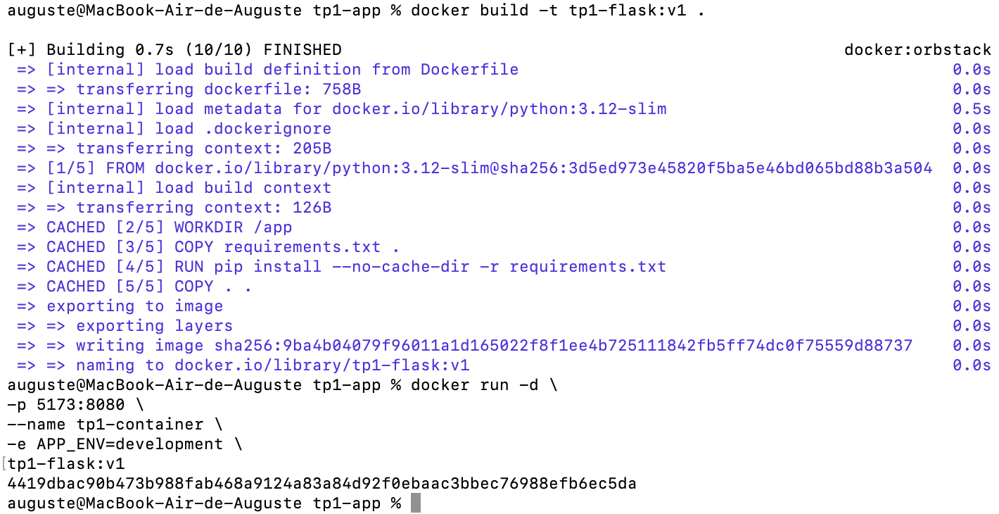
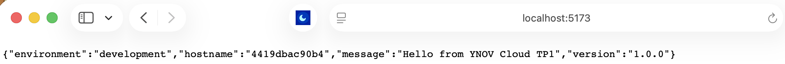
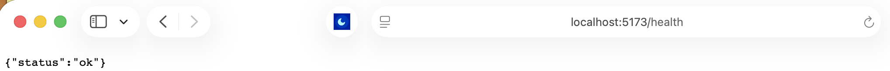

# TP1_dev_cloud

## Livrables attendus :
Capture d'écran de votre console GCP (projet créé)

Capture d'écran du terminal : résultat de gcloud config list

Capture d'écran : bucket GCS créé et listé

Capture d'écran : lancement de l'application Flask en local (docker run)

Capture d'écran : réponse de l'application Flask en local (navigateur)

Capture d'écran : santé de l'application Flask en local (navigateur)

Réponses aux questions théoriques (dans ce fichier ou sur papier)

## 1.1 — Modèles de Service
Associez chaque description au bon modèle (IaaS / PaaS / SaaS) :

Vous gérez uniquement votre code, l'infrastructure est abstraite - PaaS
Vous gérez l'OS, le middleware et l'application sur des ressources virtualisées - IaaS
Vous utilisez l'application directement via un navigateur, sans rien gérer - SaaS

Exemple GCP : Google Compute Engine - IaaS
Exemple GCP : Google App Engine / Cloud Run - PaaS
Exemple GCP : Google Workspace (Gmail, Docs) - SaaS

## 1.2 — Les 5 Caractéristiques NIST
Donnez une définition courte (1 phrase) pour chacune des 5 caractéristiques essentielles du cloud selon le NIST :

NIST #1 Self-service à la demande - Provision des ressources par l'utilisateur sans demander au fournisseur
NIST #2 Large accès réseau - Accessible depuis n'importe où, depuis le terminal
NIST #3 Mutualisation des ressources - Ressources physiques partagées, multi tenant
NIST #4 Élasticité rapide - Scalabilité des ressources simple et rapide
NIST #5 Service mesuré - Consommation mesurée, Service Pay As You Go

## 1.3 — Architecture Microservices vs Monolithe
Cochez la bonne case pour chaque affirmation :

Affirmation	Monolithe	Microservices
Déploiement indépendant de chaque composant - Microservices
Couplage fort entre les modules - Monolithe
Scalabilité horizontale de chaque service séparément - Microservices
Debugging centralisé plus simple - Monolithe
Technologie agnostique (polyglot) - Microservices

## 1.4 — Services GCP par catégorie
Complétez le tableau en plaçant chaque service GCP dans sa catégorie :
Services à placer : Cloud Run, Cloud SQL, Cloud Storage, Compute Engine, BigQuery, VPC, Cloud DNS, Cloud Logging, GKE, Persistent Disk

Catégorie Services GCP
Calcul (Compute) - Compute Engine, Cloud Run, GKE
Stockage - Cloud Storage, Persistent Disk
Base de données - Cloud SQL, BigQuery
Réseau - Cloud DNS, VPC
Observabilité - Cloud Logging

# Partie 2 — Setup GCP & gcloud CLI (30 min)
## 2.1 — Vérification de l'installation
Exécutez les commandes suivantes et notez les résultats :

Vérifier la version de gcloud installée
gcloud version

Résultat obtenu :
Google Cloud SDK 561.0.0
bq 2.1.29
core 2026.03.13
gcloud-crc32c 1.0.0
gsutil 5.36

Vérifier que Docker est installé
docker version

Résultat obtenu :
Client: Docker Engine - Community
 Version:           29.0.2
 API version:       1.52
 Go version:        go1.25.4
 Git commit:        8108357bcb
 Built:             Mon Nov 17 10:19:50 2025
 OS/Arch:           darwin/arm64
 Context:           orbstack

## 2.2 — Initialisation et configuration
Complétez les commandes manquantes (_______) puis exécutez-les :

Se connecter avec votre compte Google
gcloud auth activate-service-account

Vérifier que vous êtes bien authentifié (liste les comptes connectés)
gcloud auth list

Définir votre projet comme projet par défaut
(remplacer [MON_PROJET_ID] par votre vrai ID de projet)
gcloud config set project project-5f56a395-7a91-4564-b9e

Définir la région par défaut sur Paris
gcloud config set compute/region europe-west9

Définir la zone par défaut
gcloud config set compute/zone europe-west9-a

Vérifier la configuration complète
gcloud config list

Question : Quelle est la différence entre une région et une zone dans GCP ?
Votre réponse : Une région est une zone géographique (comme l'Europe) et cette zone contient plusieurs datacenters. Une zone est un datacenter précis.

## 2.3 — Exploration de la console
Connectez-vous à la console GCP (console.cloud.google.com) et répondez :
### a) Dans IAM & Admin → IAM, quel est votre rôle sur le projet ?
Réponse :
Administrateur d'utilisation du service
Administrateur de l'organisation
Déplaceur de projets
Propriétaire

### b) Dans Facturation, quel montant de crédit vous reste-t-il ?
Réponse : 254 €

### c) Dans APIs & Services → Tableau de bord, listez 3 APIs qui sont déjà activées par défaut :
API 1 : Cloud Storage API
API 2 : Dataplex API
API 3 : Compute Engine API

### d) Activez les APIs nécessaires pour ce module en complétant la commande :
gcloud services enable \
compute.googleapis.com \
run.googleapis.com \
container.googleapis.com \
artifactregistry.googleapis.com \
storage.googleapis.com

Vérifier que les APIs sont bien activées
gcloud services list --enabled

# Partie 3 — Google Cloud Storage : Créer, Utiliser, Supprimer (30 min)
Cloud Storage est le service de stockage objet de GCP. L'équivalent d'AWS S3.

## 3.1 — Créer un bucket Cloud Storage
Un bucket GCS doit avoir un nom globalement unique (dans tout GCP, pas juste dans votre projet).
Convention de nommage à utiliser : ynov-tp1-[votre-prenom]-[date] Exemple : ynov-tp1-alice-20032026
Remplacer [NOM_BUCKET] par votre nom unique
    --location : choisir une région GCP (utiliser europe-west9)
    --storage-class : utiliser STANDARD

gcloud storage buckets create gs://ynov-tp1-auguste-20260320 \
    --location=europe-west9 \
    --storage-class=STANDARD

Vérifier que le bucket a été créé
gcloud storage buckets list

Question : Pourquoi les noms de buckets GCS doivent-ils être globalement uniques ?
Réponse : Parce qu’un bucket GCS est accessible via un espace de nommage mondial (ex. URL publique/type DNS), partagé par tous les projets Google Cloud.
Si deux buckets avaient le même nom, il y aurait ambiguïté d’adressage, l’unicité globale garantit qu’un nom pointe vers un seul bucket au niveau mondial.

## 3.2 — Uploader et lister des objets
Créer un fichier texte local de test
echo "Hello GCP - TP1 YNOV $(date)" > test_tp1.txt

Uploader le fichier vers votre bucket
gcloud storage cp test_tp1.txt gs://ynov-tp1-auguste-20260320/

Lister les objets dans le bucket
gcloud storage ls gs://ynov-tp1-auguste-20260320/

Télécharger le fichier avec un nouveau nom
gcloud storage cp gs://ynov-tp1-auguste-20260320/test_tp1.txt ./test_tp1_downloaded.txt

Vérifier le contenu
cat ./test_tp1_downloaded.txt

## 3.3 — Métadonnées et permissions
Obtenir les informations du bucket

gcloud storage buckets describe gs://ynov-tp1-auguste-20260320

Répondre : quel est le storageClass de votre bucket ?
Réponse : STANDARD (sélectionné plus tôt)

## 3.4 — Nettoyage
Supprimer tous les objets du bucket, puis le bucket lui-même
L'option -r supprime récursivement
gcloud storage rm gs://ynov-tp1-auguste-20260320/test_tp1.txt

Vérifier la suppression
gcloud storage buckets list

# Partie 4 — Compute Engine : Cycle de Vie d'une VM (25 min)
Compute Engine est le service IaaS de GCP. Équivalent d'AWS EC2. Attention aux coûts : Supprimez la VM à la fin de cet exercice.

## 4.1 — Créer une VM minimale
Créer une VM de type e2-micro (la plus petite, éligible au Free Tier)
 --image-family : utiliser debian-12
 --image-project : utiliser debian-cloud

gcloud compute instances create tp1-vm \
--machine-type=e2-micro \
--image-family=debian-12 \
--image-project=debian-cloud \
--zone=europe-west9-b \
--tags=http-server

Lister les instances actives dans votre projet
gcloud compute instances list

Question : Quelle est la différence entre --machine-type e2-micro et --machine-type n2-standard-4 en termes de coût et d'usage ?
Réponse :
- e2-micro : très petite VM (environ 2 vCPU partagés, ~1 Go RAM), très peu coûteuse (adaptée au Free Tier selon région/conditions), idéale pour tests, petits services, TP, environnements de dev.
- n2-standard-4 : VM beaucoup plus puissante (4 vCPU, 16 Go RAM), nettement plus chère, adaptée aux charges de production, applis plus lourdes, bases de données, calculs plus intensifs.

## 4.2 — Se connecter à la VM via SSH
Connexion SSH via gcloud (gère automatiquement les clés SSH)
gcloud compute ssh tp1-vm --zone=europe-west9-b

Une fois connecté à la VM, vérifier l'OS
uname -a
cat /etc/os-release

Quitter la VM
exit

## 4.3 — Supprimer la VM (OBLIGATOIRE)
Supprimer la VM pour éviter les frais
--quiet : ne pas demander de confirmation

gcloud compute instances delete tp1-vm --zone=europe-west9-b --quiet

Vérifier que la VM n'existe plus
gcloud compute instances list

# Partie 5 — Docker : Conteneuriser une Application Flask (30 min)
Cette partie est 100% locale (pas de GCP). On prépare l'application qu'on déploiera
sur GCP au Cours 2.

## 5.1 — L'application Flask
Créez un dossier tp1-app et les fichiers suivants :
tp1-app/app.py 

## 5.2 — Écrire le Dockerfile
tp1-app/Dockerfile 

Question : Pourquoi copie-t-on requirements.txt avant le code source dans le Dockerfile ?
Réponse : On se sert du cache de build de Docker pour ne pas tout reconstruire à chaque fois

## 5.3 — Créer un .dockerignore
tp1-app/.dockerignore

## 5.4 — Build et Run

cd tp1-app
# Builder l'image Docker
# -t : nommer l'image [nom]:[tag]
docker build -t tp1-flask:v1 .
# Vérifier que l'image a été créée
docker images | grep tp1-flask

# Lancer le conteneur
# -d : mode détaché (background)
# -p [port_local]:[port_conteneur] : mapping de ports
# --name : nommer le conteneur
# -e : variable d'environnement
docker run -d \
-p 5173:8080 \
--name tp1-container \
-e APP_ENV=development \
tp1-flask:v1

# Vérifier que le conteneur tourne
docker ps

# Tester l'application
curl http://localhost:5173/
curl http://localhost:5173/health

Question : Quelle est la différence entre une image Docker et un conteneur Docker ?
Réponse : Une image Docker est un modèle immuable (template) qui contient l’application, ses dépendances et sa configuration. Un conteneur Docker est une instance de cette image, avec son propre état. On peut créer plusieurs conteneurs à partir de la même image.

## 5.5 — Nettoyage Docker
# Arrêter le conteneur
docker stop tp1-container
# Supprimer le conteneur (une fois arrêté)
docker rm tp1-container
# Vérifier qu'il n'y a plus de conteneur actif
docker ps

# Partie 6 — IAM & Service Accounts GCP (25 min)
IAM (Identity and Access Management) est le système de contrôle d'accès de GCP. Il répond à la question : "Qui peut faire quoi sur quelle ressource ?"

## 6.1 — Explorer les rôles IAM
# Lister les membres IAM de votre projet
gcloud projects get-iam-policy $(gcloud config get-value project)
# Lister les rôles prédéfinis disponibles pour Cloud Storage
gcloud iam roles list --filter="name:roles/storage" \
--format="table(name,title)"
# Question : Quelle est la différence entre roles/storage.admin
# et roles/storage.objectViewer ?
# Réponse :

## 6.2 — Créer un Service Account
Un Service Account est une identité pour les applications (pas pour les humains). Convention : sa@[project].iam.gserviceaccount.com
[application]-
PROJECT
_
ID=$(gcloud config get-value project)
# Créer un Service Account pour l'application Flask
gcloud iam service-accounts create tp1-app-sa \
--display-name="TP1 Flask App Service Account" \
--description="SA utilisé par l'application Flask pour accéder à GCS"
# Vérifier la création
gcloud iam service-accounts
_______
# Résultat attendu : liste incluant tp1-app-sa@[project].iam.gserviceaccount.com

## 6.3 — Attribuer un rôle au Service Account
Principe du moindre privilège : donner uniquement les droits nécessaires, rien de plus.
PROJECT
_
ID=$(gcloud config get-value project)
SA
_
EMAIL="tp1-app-sa@${PROJECT
_
ID}.iam.gserviceaccount.com"
# Donner uniquement le droit de LIRE les objets GCS (pas d'écriture, pas d'admin)
gcloud projects add-iam-policy-binding ${PROJECT
ID} \
_
--member="serviceAccount:${SA
EMAIL}" \
_
--role="roles/storage.
_______
" # Utiliser objectViewer (lecture seule)
# Vérifier les bindings du projet
gcloud projects get-iam-policy ${PROJECT
ID} \
_
--flatten="bindings[].members" \
--filter="bindings.members:tp1-app-sa"
Question : Pourquoi ne faut-il pas donner le rôle roles/owner ou roles/editor à un Service Account applicatif ?
Réponse :

## 6.4 — Générer et utiliser une clé de Service Account
PROJECT
_
ID=$(gcloud config get-value project)
SA
_
EMAIL="tp1-app-sa@${PROJECT
_
ID}.iam.gserviceaccount.com"
# Générer une clé JSON (fichier de credentials)
gcloud iam service-accounts keys create /tmp/tp1-sa-key.json \
--iam-account=${SA
EMAIL}
_
# Vérifier que le fichier est créé
ls -lh /tmp/tp1-sa-key.json
# Activer le Service Account dans gcloud (différent de GOOGLE
APPLICATION
_
_
# qui est réservé aux SDKs Python/Java/Go, pas à la CLI gcloud)
gcloud auth activate-service-account \
--key-file=/tmp/tp1-sa-key.json
CREDENTIALS
# Vérifier que gcloud utilise bien le SA
gcloud auth list
# Tester : essayer de créer un bucket avec ce SA
# Cela doit ÉCHOUER car le SA n'a que roles/storage.objectViewer (lecture seule)
gcloud storage buckets create gs://test-sa-${PROJECT
ID} \
_
--location=europe-west9 2>&1 || echo "Accès refusé (attendu : le SA n'a pas les droits de
création de bucket)"
# Remettre l'authentification de votre compte utilisateur
gcloud auth login
# Supprimer la clé (bonne pratique : éviter les clés qui traînent)
rm /tmp/tp1-sa-key.json
gcloud iam service-accounts keys list \
--iam-account=${SA
EMAIL}
_

Question : Quelle alternative aux clés JSON GCP recommande-t-on en production pour éviter de stocker des fichiers de
credentials ?
Réponse (indice : mécanisme "keyless") :

## 6.5 — Supprimer le Service Account (nettoyage)
gcloud iam service-accounts delete tp1-app-sa@${PROJECT
_
ID}.iam.gserviceaccount.com --quiet